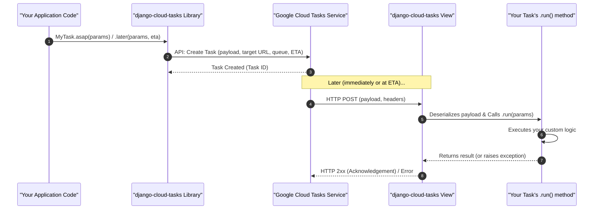

# On-Demand Tasks

On-demand tasks are your workhorses for anything you want to do asynchronously. Think of sending a welcome email after a user signs up, processing an image after upload, or calling a slow external API without making your user wait. These tasks are pushed to a Google Cloud Tasks queue and executed by an HTTP request back to your Django application.

## Defining a Basic Task

Creating a task is as simple as inheriting from `django_cloud_tasks.tasks.Task` and implementing the `run` method. This method contains the logic your task will execute.

**Example: Sending a Welcome Email**

Let's say you want to send a welcome email to a new user. Their details (like email and name) will be passed as arguments to the task.

```py title="users/tasks.py"
from django.contrib.auth.models import User
from django.core.mail import send_mail
from django_cloud_tasks.tasks import Task


class SendWelcomeEmailTask(Task):
    def run(self, user_id: int, custom_message: str | None = None): # (1)!
        try:
            user = User.objects.get(pk=user_id) # (2)!
            subject = f"Welcome to Our Awesome Platform, {user.first_name}!"
            message_body = custom_message or f"Hi {user.first_name}, \n\nThanks for signing up! We're thrilled to have you."
            send_mail(
                subject=subject,
                message=message_body,
                from_email="noreply@myawesomeplatform.com",
                recipient_list=[user.email],
                fail_silently=False,
            )
            print(f"Welcome email sent to {user.email}")
            return {"status": "success", "user_id": user_id, "email": user.email}
        except User.DoesNotExist:
            print(f"User with ID {user_id} not found. Cannot send welcome email.")
            return {"status": "error", "reason": "user_not_found"}
        except Exception as e:
            print(f"Failed to send welcome email to user {user_id}: {e}")
            raise # (3)!
```

1. The `run` method is where your task's logic resides. Arguments must be JSON serializable.
2. It's good practice to pass IDs and re-fetch database objects within the task.
3. Re-raising a generic exception will cause Cloud Tasks to retry the task based on queue configuration.

!!! info "Task Discovery"
    Django Cloud Tasks automatically discovers task classes that inherit from `Task`, `PeriodicTask`, etc.
    Just ensure the Python modules containing your task definitions (e.g., `myapp/tasks.py`) are imported by Django at startup.
    A common pattern is to import them in your app's `apps.py` within the `ready()` method.

!!! tip "Serialization"
    Arguments passed to your task's `run` method (and the return value) **must be JSON serializable**.
    Basic types like integers, strings, lists, and dicts are fine. For complex objects like Django model instances, you should pass identifiers (like a primary key) and re-fetch the object within the task, as shown in the `SendWelcomeEmailTask`.

## Running Your Tasks

Once defined, you can trigger your tasks from anywhere in your Django code (views, signals, model methods, etc.).

### Run As Soon As Possible
    
This is the most common way. It enqueues the task to be executed by Cloud Tasks as soon as a worker is available. The `kwargs` are the arguments to your task's `run` method.

```python
SendWelcomeEmailTask.asap(user_id=user_id)

SendWelcomeEmailTask.asap(user_id=user_id, custom_message="Hey there, special user!")
```

### Schedule for a Specific Future Time
    
Use this to delay a task's execution.

```python
from datetime import timedelta
from django.utils import timezone


user_id_to_follow_up = 123
task_kwargs = {
    "user_id": user_id_to_follow_up,
    "custom_message": "Hope you're enjoying the platform after your first week!",
}

SendWelcomeEmailTask.later(
    task_kwargs=task_kwargs,
    eta=timezone.now() + timedelta(days=7) # (1)!
)

SendWelcomeEmailTask.later(
    task_kwargs=task_kwargs,
    eta=30 * 60, # (2)!
)
```

1. Example of scheduling a task for a specific future `datetime`.
2. `eta` can also be an integer representing seconds from now.
   
!!! warning "Maximum ETA"
    When using `eta`, be mindful of the `DJANGO_CLOUD_TASKS_MAXIMUM_ETA_TASK` setting (or its environment variable counterpart): this setting defines the maximum number of seconds into the future a task can be scheduled. Google Cloud Tasks itself has a limit (typically 30 days).
    
    If `DJANGO_CLOUD_TASKS_MAXIMUM_ETA_TASK` is set, it imposes an additional, potentially more restrictive, limit within your application.
    *   Default: `None` (meaning the library doesn't impose its own limit beyond GCP's).
    *   Example: `DJANGO_CLOUD_TASKS_MAXIMUM_ETA_TASK = 60 * 60 * 24 * 7` (limit to 7 days).

### Run Synchronously
    
Executes the task's `run` method immediately in the current process. This is the default behavior if `DJANGO_CLOUD_TASKS_EAGER = True` is set in your settings. It's extremely helpful for debugging and local development.

```python
SendWelcomeEmailTask.sync( # (1)!
    user_id=some_user.id,
    custom_message="Testing sync call.",
)
```

1. This will run the `SendWelcomeEmailTask.run()` method directly.

### Schedule Randomly Before a Deadline

Schedules the task to run at a random time between now and the specified `max_eta` (maximum execution time).

Useful for distributing load for non-time-critical tasks. It's not a load balancer, it's just a way to schedule tasks to run at different times.

```python
from django.utils import timezone
from datetime import timedelta


class ProcessAnalyticsBatch(Task):
    def run(self, user_ids: list[int]):
        max_execution_time = timezone.now() + timedelta(hours=1)

        for user_id in user_ids:
            SendWelcomeEmailTask.until(
                task_kwargs={"user_id": user_id},
                max_eta=max_execution_time, # (1)!
            )
```

1. Process a batch of optional analytics updates sometime in the next hour


## How It Works Under the Hood

When you trigger an on-demand task using methods like `asap()` or `later()`, several steps occur behind the scenes to ensure your task is processed reliably and asynchronously:

1.  **Task Invocation:** Your application code calls a task method (e.g., `SendWelcomeEmailTask.asap(user_id=123)`).
2.  **Payload & Target Construction:** `django-cloud-tasks` serializes the provided arguments (e.g., `user_id=123`) into a JSON payload. It also determines the target Google Cloud Tasks queue and the specific HTTP endpoint URL within your Django application that is configured to execute this task.
3.  **Google Cloud Tasks API Call:** The library makes an authenticated API call to the Google Cloud Tasks service. This call instructs Cloud Tasks to create a new task in the designated queue. The request to GCP includes the JSON payload, the target URL, any specified ETA (for `.later`), and other execution options (like `only_once` or custom headers if using `push()`).
4.  **Task Queuing by GCP:** Google Cloud Tasks receives this request, validates it, and securely stores the task in the specified queue. The task now waits for a worker to become available or for its scheduled ETA to arrive.
5.  **HTTP Invocation by GCP:** At the appropriate time (immediately for `asap`, or after the ETA for `later`), Google Cloud Tasks makes an HTTP POST request from its infrastructure to the target URL of your Django application. This request includes the JSON payload in its body and any necessary headers (e.g., for tracing, authentication, or propagated headers).
6.  **Task Execution in Django:** Your Django application receives this incoming HTTP request. The `django-cloud-tasks` view handler, mapped via `django_cloud_tasks.urls`, processes this request. It identifies the correct task class (e.g., `SendWelcomeEmailTask`) based on the URL, deserializes the JSON payload from the request body into Python arguments, and then calls the task's `run()` method with these arguments.
7.  **Acknowledgement to GCP:** Upon successful receipt and initial processing by your Django endpoint (specifically, if the endpoint returns an HTTP 2xx status code like 200 OK or 202 Accepted), Google Cloud Tasks considers the task acknowledged and removes it from the queue (or marks it as completed, subject to retry policies if errors occurred during the `run` method that weren't handled).

This entire process ensures that your task invocation is decoupled from its actual execution, providing benefits like resilience to temporary failures (through retries managed by Cloud Tasks) and improved application responsiveness by offloading work to background processes.



## Advanced Task Configuration

You can fine-tune task behavior using several class attributes and methods on your `Task` subclass. These configurations often map to Google Cloud Tasks API features.

### Ensuring Uniqueness

Set `only_once = True` on your task class if you want to prevent duplicate enqueues of tasks that are identical *by class name* for a given queue. Cloud Tasks will use a deterministic task name derived from your task's class name.

*   **Use Case:** Imagine you have a task `ProcessOrderTask` that gets called when an order is submitted. If, due to a client-side retry or a race condition, your system tries to enqueue `ProcessOrderTask` for the *same order* multiple times in quick succession *before the first one is picked up*, `only_once = True` can help prevent multiple identical tasks for that order from being added to the queue initially.

!!! warning "De-duplication"
    This de-duplication is based on the task *class name*. It doesn't consider task arguments.
    
    If you need de-duplication based on specific arguments (e.g., "only one `ProcessOrderTask` for `order_id=123`"), you'd need to implement that logic yourself, perhaps by checking for an existing task with a custom-generated name via the `push()` method.

```python
class ProcessOrderTask(Task):
    only_once = True

    def run(self, order_id: int, payment_details: dict):
        print(f"Processing order {order_id}...")
        # ... order processing logic ...
```

### Enqueue Retry Policy

These settings control retries if the the act of trying to send the task to Google Cloud Tasks fails, for example, due to a transient network issue or a temporary problem with the Cloud Tasks API. This is **not** about retrying your task if its `run()` method fails.

*   **`enqueue_retry_exceptions: list[str | Type[Exception]] | None`**: A list of exception types (or their string paths like `'google.api_core.exceptions.ServiceUnavailable'`) that should trigger a retry. Defaults to an empty list (or what's set globally via `DJANGO_CLOUD_TASKS_ENQUEUE_RETRY_EXCEPTIONS`).
*   **`enqueue_retry_initial: float | None`**: Initial delay in seconds for the first retry. Defaults to global config.
*   **`enqueue_retry_maximum: float | None`**: Maximum delay in seconds between retries. Defaults to global config.
*   **`enqueue_retry_multiplier: float | None`**: Multiplier for increasing the delay between retries. Defaults to global config.
*   **`enqueue_retry_deadline: float | None`**: Total time in seconds to keep retrying. Defaults to global config.

```python
from google.api_core.exceptions import ServiceUnavailable, InternalServerError

class RobustEnqueueTask(Task):
    enqueue_retry_exceptions = [ServiceUnavailable, InternalServerError, "requests.exceptions.ConnectionError"] # (1)!
    enqueue_retry_initial = 2.0  # (2)!
    enqueue_retry_maximum = 60.0 # (3)!
    enqueue_retry_multiplier = 2.5 # (4)!
    enqueue_retry_deadline = 300.0 # (5)!

    def run(self, data: dict):
        print("Task enqueued robustly and now running.")
```

1. List of exceptions that should trigger a retry.
2. Start with a 2-second delay for retries.
3. Cap retries at 1-minute intervals.
4. Multiply the delay by 2.5 each time.
5. Try for up to 5 minutes in total.

### Using Custom Queue Names

By default, tasks are sent to a queue named after your `DJANGO_CLOUD_TASKS_APP_NAME` (or just `"tasks"` if `APP_NAME` is not set). You can direct specific tasks to different queues by overriding the `queue()` class method. This is useful for prioritizing tasks or managing different workloads (e.g., short, quick tasks vs. long-running batch jobs).

Make sure any custom queues you specify actually exist in your Google Cloud Tasks project.

```python
class HighPriorityNotification(Task):
    @classmethod
    def queue(cls) -> str:
        return "critical-notifications-queue"

    def run(self, user_id: int, alert_message: str):
        # ... send an urgent alert ...
        print(f"Sent high priority alert to user {user_id}")


class BatchDataProcessing(Task):
    @classmethod
    def queue(cls) -> str:
        return "batch-jobs-queue"

    def run(self, dataset_id: str):
        # ... process a large dataset ...
        print(f"Processed batch data for {dataset_id}")
```

### Suggesting a Task Timeout

Cloud Tasks need to know how long to wait for your task to complete before considering it timed out. You can suggest a timeout by overriding `get_task_timeout()`. The actual timeout is ultimately controlled by the queue configuration in GCP, but this provides a hint.

```python
from datetime import timedelta


class ReportGenerationTask(Task):
    @classmethod
    def get_task_timeout(cls) -> timedelta | None:
        return timedelta(minutes=15) # (1)!

    def run(self, report_params: dict):
        # ... logic to generate a potentially long report ...
        print("Report generation complete.")
```

1. This report can sometimes take a while; suggest Cloud Tasks allow up to 15 minutes.

### Accessing Task Metadata

Inside your task's `run` method, you can access information about the current execution attempt via `self._metadata`. This is an instance of `TaskMetadata` (or your custom class specified by `DJANGO_CLOUD_TASKS_TASK_METADATA_CLASS`).

*   **Use Case:** You might want to log the attempt number, or have slightly different behavior on the first attempt versus a retry (e.g., more aggressive external API calls on first try, then back off).

```python
class RetryAwareTask(Task):
    def run(self, api_call_details: dict):
        print(f"--- Task Execution --- ")
        print(f"Task ID: {self._metadata.task_id}")
        print(f"Queue: {self._metadata.queue_name}")
        print(f"Attempt Number (dispatch count + 1): {self._metadata.attempt_number}") # (1)
        print(f"Execution Number (non-5XX responses): {self._metadata.execution_number}") # (2)
        print(f"Scheduled ETA: {self._metadata.eta}")

        if self._metadata.previous_failure: # (3)
            print(f"This task previously failed with reason: {self._metadata.previous_failure}")

        if self._metadata.is_cloud_scheduler: # (4)
             print(f"This task was triggered by Cloud Scheduler job: {self._metadata.cloud_scheduler_job_name}")

        # Example: Different logic for first attempt vs retries
        if self._metadata.first_attempt: # (5)
            print("First attempt: trying the primary API endpoint.")
            # make_api_call(api_call_details, endpoint_type="primary")
        else:
            print("Retry attempt: trying a fallback API endpoint or with reduced payload.")
            # make_api_call(api_call_details, endpoint_type="fallback")
        
        # Your main task logic here
        # ...
```

1. `attempt_number` reflects how many times Cloud Tasks has tried to dispatch this task.
2. `execution_number` reflects non-5XX responses.
3. Check if the task has failed before.
4. Check if the task was triggered by Cloud Scheduler.
5. Implement different logic based on whether it's the first attempt or a retry.

### Low-Level Control

For the most granular control over task enqueuing, you can use the `push()` class method directly. `asap()` and `later()` are convenient wrappers around `push()`. This allows you to specify custom headers, a dynamically generated task name (useful for more specific de-duplication than `only_once`), or override the queue dynamically.

```python
import hashlib

unique_part = hashlib.md5(f"{user_id}-{item_id}".encode()).hexdigest()  # (1)!
deterministic_task_name = f"ProcessItemTask-{unique_part}"

SendWelcomeEmailTask.push(
    task_kwargs={"user_id": 777, "custom_message": "Pushed with full control!"},
    headers={"X-Correlation-ID": "my-custom-trace-id"}, # (2)!
    delay_in_seconds=60, # (3)!
    queue="another-dynamic-queue", # (4)!
    task_name=deterministic_task_name, # (5)!
)
```

1. Generate a unique task name for de-duplication based on arguments
2. Custom headers for this specific push.
3. Delay by 1 minute.
4. Can override queue here too.
5. Provide a specific task name, e.g., for de-duplication.

## Debugging Tasks

Django Cloud Tasks provides a couple of utility methods on your task classes for interacting with tasks **already in a queue**.

If a task has failed in the cloud, or you want to re-run a specific execution locally with the exact same payload it had, you can use `debug()`.

*   **How it works:** It fetches the task details (including its original payload) from Google Cloud Tasks using its `task_id` and then executes the `run()` method locally (synchronously) with that payload. It also populates `self._metadata` from the fetched task information.

```python
# from myapp.tasks import SendWelcomeEmailTask

task_id_from_gcp = "1234567890abcdef" # (1)!
SendWelcomeEmailTask.debug(task_id=task_id_from_gcp)
```

1.  You'd typically get the `task_id` from your Google Cloud Tasks Queue

## Discarding Tasks

Once a bunch of tasks have been enqueued, it can be hard to keep track of them, specially when they start failing and cause a snowball effect of retries.

For these use cases, you can remove tasks from a Google Cloud Tasks queue.

!!! warning "Be careful"
    This will delete tasks from a Google Cloud Tasks queue.
    
    Be very careful with this.

### Discard One Task

When you know exactly the problematic task, you can discard it by its Task ID.

```python
task_id_from_gcp = "1234567890abcdef" # (1)!
SendWelcomeEmailTask.discard(task_id=task_id_from_gcp)
```

1.  You'd typically get the `task_id` from your Google Cloud Tasks Queue

### Discard All Tasks

If multiple tasks share the same queue, you can discard all tasks of a certain type.

```python
SendWelcomeEmailTask.discard() # (1)!
```

1. This will list all tasks for `SendWelcomeEmailTask` in its default queue and delete them.

### Discard Persistently Failing Tasks

You can discard tasks of a certain type that have met a minimum retry count.

```python
SendWelcomeEmailTask.discard(min_retries=5) # (1)!
```

1. Deletes all `SendWelcomeEmailTask` instances from the queue that have been dispatched (retried) at least 5 times.

### Handling Failed Tasks

Any exception raised by your task's `run()` method is considered a failure.

This will inform Google Cloud Tasks to retry the task, according to the policy you've set.

If you want to skip retrying a task, you can raise `DiscardTaskException` from within your task.

```python
class MyTask(Task):
    def run(self, *args, **kwargs):
        # ...
        raise DiscardTaskException("Task failed, skipping retries.")
```


This covers the ins and outs of on-demand tasks. They form the foundation for many asynchronous operations in your Django application.