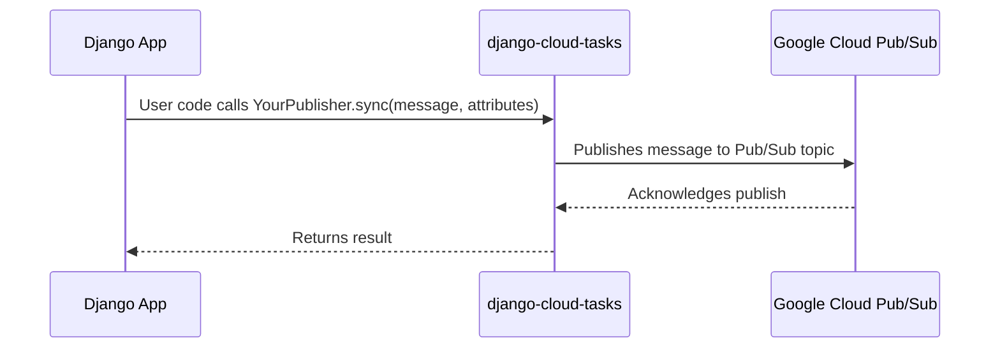
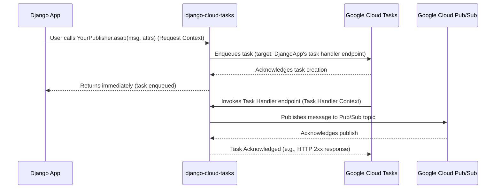
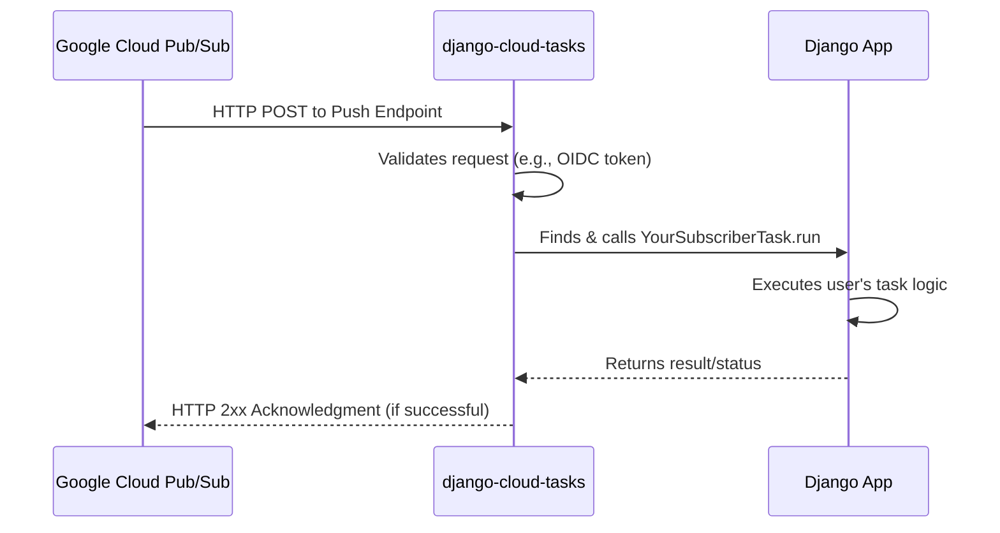

# Publishing & Subscribing

Django Cloud Tasks seamlessly integrates with Google Cloud Pub/Sub, enabling you to build powerful event-driven architectures.

You can publish messages to Pub/Sub topics when something interesting happens in your application, and define subscriber tasks that react to these messages asynchronously.

## Publishing

Messages are published to specific "topics." You can think of a topic as a named channel for a certain category of events (e.g., "user-signups", "order-updates").

There are two main base classes for creating publishers:

1.  **`PublisherTask`**: For publishing general-purpose dictionary-based messages.
2.  **`ModelPublisherTask`**: A specialized helper for easily publishing messages related to Django model instance events (e.g., when a model is created, updated, or deleted).

### Basic Publisher

Inherit from `PublisherTask` to define a generic message publisher. The primary method to override is `topic_name()`.

**Example: Publishing User Action Events**

Let's say we want to publish an event whenever a critical user action occurs, like a password change or profile update.

```py title="publishers.py"
from django_cloud_tasks.tasks import PublisherTask

class UserActionEventPublisher(PublisherTask):
    @classmethod
    def topic_name(cls) -> str:
        return "user-actions" # (1)!

```

1.  The base name for the Pub/Sub topic. The final topic name in GCP might be prefixed (e.g., `my-app--user-actions`).

Then, you can use it in any part of your codebase (e.g., in views or signals):

```py title="views.py"
from django.utils import timezone
from .publishers import UserActionEventPublisher # Assuming this file is publishers.py

def my_view(request):
    user = request.user
    event_payload = {
        "user_id": user.id,
        "action_type": "password_changed",
        # "ip_address": get_client_ip(request), # A helper function to get IP
        "timestamp": timezone.now().isoformat()
    }
    UserActionEventPublisher.asap(
        message=event_payload,
        attributes={"priority": "high"},
    )
    # ... rest of view logic ...
```

!!! info "Publishing Modes"

    There are two main modes for publishing messages:

    *   **Asynchronous Publishing (`asap`)**: The message is published asynchronously via Google Cloud Tasks. This is the recommended approach for most use cases.
    *   **Synchronous Publishing (`sync`)**: The message is published synchronously in the current process. This is not recommended for most use cases, but can be useful for certain scenarios.


### Model Publisher

Inherit from `ModelPublisherTask` to define a message publisher that is specifically tied to a Django model instance.

!!! tip "Useful for Model Instances"
    This class is incredibly useful when the event you want to publish is directly tied to a Django model instance (e.g. notifying that a model has been created, updated, or deleted).

**Example: Publishing Order Creation Events**

```py title="publishers.py"
from django_cloud_tasks.tasks import ModelPublisherTask
from .models import Order # Assuming Order model is in models.py

class OrderCreatedEvent(ModelPublisherTask):
    @classmethod
    def build_message_content(cls, obj: models.Model, **kwargs) -> dict:
        order = obj # Type hint as Order if needed: order: Order = obj
        return {
            "order_id": str(order.order_id),
            "user_id": order.user_id,
            "total_amount": float(order.total_amount), # (1)!
            "status": order.status,
            "created_at_iso": order.created_at.isoformat(),
            "campaign_source": kwargs.get("campaign_source") # (2)!
        }

    @classmethod
    def build_message_attributes(cls, obj: models.Model, **kwargs) -> dict[str, str]:
        order = obj # Type hint as Order if needed
        return {
            "event_type": "order_created",
            "customer_segment": "retail",
            "region": kwargs.get("region", "unknown")
        }
```

1.  Pub/Sub message content should ideally use basic JSON-serializable types.
2.  Extra keyword arguments passed to `asap()`, `sync()`, or `sync_on_commit()` are available in `build_message_content` and `build_message_attributes`.
3.  `sync_on_commit` ensures the message is published only if the surrounding database transaction commits successfully.

Then, you can use it in any part of your codebase (e.g., in signals):

```py title="signals.py"
from django.db import transaction
from .publishers import OrderCreatedEvent
from .models import Order

def order_created_handler(sender, instance, created, **kwargs):
    if created:
        OrderCreatedEvent.asap(
            obj=instance,
            campaign_source="spring_sale",
            region="emea"
        )
    # ... rest of signal logic ...
```


**Key methods for `ModelPublisherTask`:**

*   **`build_message_content(cls, obj: Model, **kwargs) -> dict` (Required):** You implement this to transform your model instance (`obj`) and any extra `kwargs` into the main JSON payload of the Pub/Sub message.
*   **`build_message_attributes(cls, obj: Model, **kwargs) -> dict[str, str]` (Required):** You implement this to create a dictionary of string-to-string attributes for the Pub/Sub message. Attributes are useful for filtering messages on the subscriber side without needing to parse the full JSON payload.
*   `sync_on_commit(obj: Model, **kwargs)`: A very handy method that delays the actual publishing until the current database transaction is successfully committed. This prevents sending messages for data that might be rolled back.

### Topic Naming Convention

*   **Default `topic_name()` for `PublisherTask`:** Uses the class name (e.g., `UserActionEventPublisher` becomes topic base name `UserActionEventPublisher`).
*   **Default `topic_name()` for `ModelPublisherTask`:** Uses `app_label-model_name` (e.g., if `Order` is in `sales` app, it becomes `sales-order`).
*   **Global Prefixing:** If `DJANGO_CLOUD_TASKS_APP_NAME` is set in your Django settings (e.g., to `"my-ecom-service"`), this name, along with the `DJANGO_CLOUD_TASKS_DELIMITER` (default `"--"`), will be **prepended** to the base topic name. So, `UserActionEventPublisher` could become `my-ecom-service--UserActionEventPublisher` in GCP.
*   This prefixing helps organize topics in GCP, especially if multiple services share a project.


## Subscribing

To process messages published to a topic, you define a `SubscriberTask`.

This task will be triggered via an HTTP push request from Google Cloud Pub/Sub to a dedicated endpoint in your Django application when a new message arrives on the subscribed topic.

**Example: Processing User Action Events and Order Notifications**

```py title="subscribers.py"
from django_cloud_tasks.tasks import SubscriberTask


class UserActionAuditor(SubscriberTask):
    @classmethod
    def topic_name(cls) -> str:
        return "user-actions" # (1)!

    def run(self, content: dict, attributes: dict[str, str] | None = None):
        print(f"Auditing user action: {content.get('action_type')} for user {content.get('user_id')}")
        print(f"  Attributes: {attributes}")
        # ... rest of subscriber logic ...
        return {"status": "action_audited", "user_id": content.get('user_id')}


class OrderNotificationHandler(SubscriberTask):
    @classmethod
    def topic_name(cls) -> str:
        return "sales-order" # (2)!

    def run(self, content: dict, attributes: dict[str, str] | None = None):
        print(f"New order received for processing: {content.get('order_id')}")
        print(f"  Event Type (from attribute): {attributes.get('event_type')}")
        # ... rest of subscriber logic ...
        return {"status": "order_processed", "order_id": content.get('order_id')}
```

1.  The base topic name this subscriber listens to. Must match the `topic_name` of `UserActionEventPublisher`.
2.  The base topic name for order-related events. Must match the `topic_name` used by `OrderCreatedEvent`.

**Key elements for `SubscriberTask`:**

*   **`topic_name(cls) -> str` (Required):** Specifies which Pub/Sub topic this task subscribes to. This name needs to match the *base name* of the publisher's topic (before any global `APP_NAME` prefixing).
*   **`run(content: dict, attributes: dict[str, str] | None = None)`:** Your core logic to handle the incoming message. `content` is the deserialized JSON payload, and `attributes` are the string key-value pairs sent with the Pub/Sub message.

### Subscription Naming Convention

*   **Default `subscription_name()`:** Similar to topics, the subscription name is derived from `DJANGO_CLOUD_TASKS_APP_NAME` (if set), the `DJANGO_CLOUD_TASKS_DELIMITER`, and the `SubscriberTask` class name (e.g., `my-ecom-service--UserActionAuditor`).
*   This name is used for the actual Pub/Sub Subscription resource created in GCP.

### Setting Up and Deploying Subscriptions

Defining the `SubscriberTask` class in Python doesn't automatically create the subscription in Google Cloud Pub/Sub. You need to run a management command to assure that the subcriptions defined in your codebase are properly reflected in GCP.

Subscriptions will be created, updated, or deleted as needed.

```bash
python manage.py initialize_subscribers
```

!!! tip "When to run `initialize_subscribers`?"
    Run this as part of your deployment process, especially when you add new `SubscriberTask`s or change their subscription configurations (like `topic_name`, `filter`, retry policies, etc.).


## How It Works Under the Hood

Understanding the flow of messages from publisher to subscriber can be helpful for debugging and advanced configurations.


### Synchronous Publishing Flow

In this mode, the call to publish the message to Google Cloud Pub/Sub happens directly in the process that initiated it.

You can perform this operation by calling `YourPublisher.sync(message, attributes)`.



**Steps for Synchronous Publishing:**

1.  **Initiation:** Your application code calls `YourPublisher.sync(message, attributes)`.
2.  **Direct Call:** The `django-cloud-tasks` library directly invokes the Google Cloud Pub/Sub API to publish the provided message and attributes.
3.  **Acknowledgment:** Google Cloud Pub/Sub acknowledges the receipt of the message.
4.  **Return:** The `sync()` method returns. This operation is blocking.

### Asynchronous Publishing Flow

This is the recommended approach for scenarios like web requests where you don't want to block the main process.

Publishing is offloaded to a background task via Google Cloud Tasks.

You can perform this operation by calling `YourPublisher.asap(message, attributes)`.



**Steps for Asynchronous Publishing:**

1.  **Initiation (Django App - Request Context):** Your application code (e.g., in a Django view) calls `YourPublisher.asap(message, attributes)` using the `django-cloud-tasks` library.
2.  **Task Creation (django-cloud-tasks Library):** The library code within your `DjangoApp` constructs a request to the `Google Cloud Tasks` service. This request defines a new task, specifying the payload (your message and attributes) and the target (an HTTP endpoint within your own `DjangoApp` designated for processing these publish tasks).
3.  **Enqueueing (Google Cloud Tasks Service):** The `Google Cloud Tasks` service receives the request, creates the task, and stores it in a queue. It then acknowledges task creation back to the `django-cloud-tasks` library.
4.  **Immediate Return (Django App - Request Context):** The `asap()` method in your application code returns quickly to the caller (e.g., your Django view), as its primary job (enqueueing the task) is complete. The actual publishing happens in the background.
5.  **Task Invocation (Google Cloud Tasks Service to Django App - Task Handler Context):** At a later time, the `Google Cloud Tasks` service dequeues the task and invokes the target handler endpoint in your `DjangoApp`. This is an HTTP POST request to a specific URL in your application (e.g., handled by `django_cloud_tasks.views.ProcessCloudTaskView`).
6.  **Message Publishing (Django App - Task Handler Context using django-cloud-tasks Library):** The task handler code within your `DjangoApp` (specifically, the `django-cloud-tasks` view that processes the task) extracts the message and attributes from the task payload. It then re-uses the `django-cloud-tasks` library's internal publishing logic to send the message to the `Google Cloud Pub/Sub` service.
7.  **Pub/Sub Acknowledgment (Google Cloud Pub/Sub to django-cloud-tasks Library):** `Google Cloud Pub/Sub` receives the message, stores it, and acknowledges its receipt back to the `django-cloud-tasks` publishing logic running within your task handler.
8.  **Task Completion (Django App - Task Handler Context to Google Cloud Tasks Service):** After successfully publishing to Pub/Sub, your task handler (via the `django-cloud-tasks` library) returns an HTTP 2xx success response to the `Google Cloud Tasks` service. This acknowledges that the task has been completed successfully, and `Google Cloud Tasks` will not attempt to retry it.

### Subscription Flow

Once a message is in Pub/Sub, the delivery to subscribers happens as follows (assuming a push subscription, which is the default for `django-cloud-tasks`):



**Steps for Subscription Flow:**

1.  **Message Delivery:** When a message is published to a topic, Google Cloud Pub/Sub identifies all subscriptions for that topic. For push subscriptions, Pub/Sub sends an HTTP POST request.
2.  **Push Endpoint:** This request is sent to a unique URL generated by `django-cloud-tasks` for each `SubscriberTask` (e.g., `/_tasks/pubsub/MyApp--MySubscriberTaskName/`). This endpoint is handled by `django_cloud_tasks.views.ProcessPubSubPushView`.
3.  **Request Handling by `django-cloud-tasks`:**
    *   Receives the incoming HTTP request.
    *   Validates the request, typically by checking an OIDC token attached by Google Pub/Sub to ensure authenticity (i.e., that the request genuinely came from Pub/Sub for that specific subscription).
    *   Extracts the message content (deserialized from JSON by default) and attributes.
4.  **User Task Execution:**
    *   The library identifies the correct `SubscriberTask` class based on the URL.
    *   It instantiates the task and calls its `run(content, attributes)` method, passing the deserialized message.
5.  **Acknowledgment to Pub/Sub:**
    *   If your `run()` method completes successfully (i.e., doesn't raise an unhandled exception), `django-cloud-tasks` returns an HTTP 2xx status code (e.g., 200 OK or 204 No Content) back to Google Cloud Pub/Sub.
    *   This 2xx response acknowledges that the message has been successfully processed. Pub/Sub will then not attempt to redeliver it.
    *   If your `run()` method raises an exception, or if the endpoint returns a non-2xx status (e.g., 500), Pub/Sub will consider the message delivery failed and will attempt to redeliver it according to the subscription's configured retry policy.

This overall flow leverages Google Cloud's infrastructure for reliable, at-least-once message delivery.


## Advanced Pub/Sub Configuration

### Custom Topic Names

For both `PublisherTask` and `ModelPublisherTask`, you can override `topic_name(cls, ...)` for more control.

```py title="publishers.py"
from django.db import models # Assuming you're using models with ModelPublisherTask
from django_cloud_tasks.tasks import PublisherTask, ModelPublisherTask

class LegacySystemEventPublisher(PublisherTask):
    @classmethod
    def topic_name(cls) -> str:
        return "legacy-integration-bus" # (1)!

# For ModelPublisherTask, topic_name can also use the object
class ProductUpdateToSpecificChannel(ModelPublisherTask): # (2)!
    @classmethod
    def topic_name(cls, obj: models.Model, **kwargs) -> str: # (3)!
        product = obj # Type hint as Product if needed
        if product.category == "electronics":
            return "product-updates-electronics"
        return "product-updates-general"

    # Remember to implement build_message_content and build_message_attributes
    @classmethod
    def build_message_content(cls, obj: models.Model, **kwargs) -> dict:
        # Replace with actual implementation
        return {"product_id": obj.pk, "name": getattr(obj, 'name', '')}

    @classmethod
    def build_message_attributes(cls, obj: models.Model, **kwargs) -> dict[str, str]:
        # Replace with actual implementation
        return {"category": getattr(obj, 'category', 'unknown')}

```

1.  Overrides the default naming (based on class name) to a fixed, custom topic name.
2.  This example demonstrates dynamically choosing a topic based on the model's data.
3.  When `ModelPublisherTask.topic_name` accepts an `obj` argument, it can tailor the topic per instance.

Remember that if `DJANGO_CLOUD_TASKS_APP_NAME` is set, it will still be prefixed unless your override includes it or is absolute.


### Custom Subscription Name

While default naming is usually fine, you can override `subscription_name()` if needed, similar to `schedule_name` for periodic tasks.

### Custom Subscription URL

This is rarely needed, as the default URL points to the correct handler in `django-cloud-tasks`. Overriding this means you're pointing Pub/Sub to a custom endpoint you've built.

### OIDC Authentication

*   Class attribute `_use_oidc_auth: bool = True`.
*   Controls if the Pub/Sub push subscription expects Google to send an OIDC token for authentication. Generally, keep this `True` if your Django app runs on a service like Cloud Run that can validate these tokens.

### Subscription Retry Policy

These settings on your `SubscriberTask` class map to the Pub/Sub subscription's message delivery retry configuration. They define how Pub/Sub handles messages if your endpoint doesn't acknowledge them (e.g., returns an error or times out).

*   **`max_retries: int | None = UNSET`**: Maximum delivery attempts before sending to a dead-letter topic (if configured). Defaults to global `DJANGO_CLOUD_TASKS_SUBSCRIBER_MAX_RETRIES` or GCP default.
*   **`min_backoff: int | None = UNSET`**: Minimum delay (in seconds) Pub/Sub waits before redelivering an unacknowledged message. Defaults to global `DJANGO_CLOUD_TASKS_SUBSCRIBER_MIN_BACKOFF` or GCP default (typically 10s).
*   **`max_backoff: int | None = UNSET`**: Maximum delay (in seconds) for redelivery. Defaults to global `DJANGO_CLOUD_TASKS_SUBSCRIBER_MAX_BACKOFF` or GCP default (typically 600s).

```py title="subscribers.py"
from django_cloud_tasks.tasks import SubscriberTask
from django_cloud_tasks.constants import UNSET

class TimeSensitiveAlertSubscriber(SubscriberTask):
    _use_oidc_auth = True # Ensure OIDC token is expected
    max_retries = 5         # (1)!
    min_backoff = 20        # (2)!
    max_backoff = 120       # (3)!

    @classmethod
    def topic_name(cls) -> str:
        return "critical-alerts"

    def run(self, content: dict, attributes: dict[str, str] | None = None):
        # Process time-sensitive alert
        print(f"Processing alert: {content}")
        # ...
        return {"status": "alert_processed"}

# Example of using a dead-letter topic
class ImportantEventSubscriber(SubscriberTask):
    dead_letter_topic_name = "failed-important-events" # (4)!
    # dead_letter_subscription_name = "my-app--custom-dlt-sub-for-important-events" # (5)!
    max_retries = 3 # (6)!

    @classmethod
    def topic_name(cls) -> str:
        return "important-events"

    def run(self, content: dict, attributes: dict[str, str] | None = None):
        # Process important event
        if content.get("value") == "problem": # Simulate a processing failure
             raise ValueError("Simulated processing error for important event")
        print(f"Processing event: {content}")
        return {"status": "event_processed"}

```

1.  Attempt message delivery up to 5 times.
2.  Wait at least 20 seconds before the first retry.
3.  Cap the maximum delay between retries to 120 seconds.
4.  If message processing fails after `max_retries` (3 in this case), it will be sent to the Pub/Sub topic named `failed-important-events` (prefixed by `DJANGO_CLOUD_TASKS_APP_NAME` if set).
5.  Optionally, specify a custom name for the dead-letter *subscription* itself. If not set, a default name will be generated.
6.  Try processing up to 3 times before the message is eligible for the dead-letter topic.

### Dead Letter Topics

If a message consistently fails processing after configured retries, Pub/Sub can forward it to a Dead Letter Topic (DLT). This is crucial for ensuring that problematic messages don't get stuck in an infinite retry loop and can be investigated later.

*   **`dead_letter_topic_name: str | None = None`**: The base name of the Pub/Sub topic to use as a DLT. If set, `django-cloud-tasks` will configure the main subscription to send messages here after `max_retries` have been exhausted. The actual DLT name in GCP will be prefixed by `DJANGO_CLOUD_TASKS_APP_NAME` if configured.
*   **`dead_letter_subscription_name: str | None = None`**: Optionally, specify a custom name for the subscription that `django-cloud-tasks` creates for the dead-letter topic. If not provided, a default name is generated. This subscription is just a way to inspect messages in the DLT; you might also have a separate `SubscriberTask` listening to this DLT for automated processing or alerting.

The `initialize_subscribers` command will attempt to create the dead-letter topic if it doesn't exist and grant the necessary permissions for the Pub/Sub service account to publish to it.

### Message Filtering

Pub/Sub allows subscriptions to specify a filter, so the subscription only receives messages whose attributes match the filter. This can reduce the number of messages your subscriber task needs to process and can be more efficient than filtering in your task's `run` method.

*   **`subscription_filter: str | None = None`**: A class attribute. Set this to a filter string according to the [Pub/Sub filter syntax](https://cloud.google.com/pubsub/docs/subscription-message-filter#filtering_syntax).

```py title="subscribers.py"
from django_cloud_tasks.tasks import SubscriberTask

class FilteredEventSubscriber(SubscriberTask):
    # Example: attributes.eventType = "user_signup" OR attributes.priority = 'high'
    subscription_filter = 'attributes.event_type = "user_signup" OR attributes.event_type = "user_delete"'  # (1)!

    @classmethod
    def topic_name(cls) -> str:
        return "generic-user-events"

    def run(self, content: dict, attributes: dict[str, str] | None = None):
        event_type = attributes.get("event_type")
        print(f"Processing filtered event of type '{event_type}': {content}")
        # ... logic for user_signup or user_delete events
        return {"status": f"{event_type}_processed"}

```

1.  This filter string tells Pub/Sub to only deliver messages that have an `event_type` attribute of either `"user_signup"` or `"user_delete"`. The filter is applied by GCP Pub/Sub before delivering the message.

### Custom Message Parser

By default, `SubscriberTask` expects the Pub/Sub message data to be a JSON-encoded string (UTF-8). If your messages are published in a different format (e.g., plain text, Avro, Protobuf), you can provide a custom static method to parse the raw message body.

*   **`message_parser(data: bytes, attributes: dict[str, str] | None = None) -> TypedMessage`**: A `staticmethod` on your `SubscriberTask` class.
    *   It receives the raw message `data` as `bytes` and the message `attributes`.
    *   It should return an instance of `django_cloud_tasks.typed_message_sender.TypedMessage`. The `content` field of this `TypedMessage` can be any Python object (e.g., a Pydantic model, a dictionary, a custom class instance).
    *   The `run` method of your task will then receive this parsed object as its `content` argument.

```py title="subscribers.py"
import json # Or your custom deserialization library
from django_cloud_tasks.tasks import SubscriberTask
from django_cloud_tasks.typed_message_sender import TypedMessage # (1)!

# Assume this Pydantic model is defined elsewhere, e.g., in schemas.py
# from pydantic import BaseModel, Field
# from typing import Literal
# class UserActivity(BaseModel):
#     user_id: int
#     activity_type: Literal["login", "logout", "post_comment"]
#     timestamp: str # ISO format string

class PydanticMessageSubscriber(SubscriberTask):
    @classmethod
    def topic_name(cls) -> str:
        return "user-activity-stream"

    @staticmethod
    def message_parser(data: bytes, attributes: dict[str, str] | None = None) -> TypedMessage: # (2)!
        # from .schemas import UserActivity # Assuming UserActivity is in schemas.py
        # For this example, we'll use a simple dict instead of a Pydantic model
        # to avoid adding a Pydantic dependency just for this example.
        # In a real scenario, you would parse into your Pydantic model here:
        # parsed_content = UserActivity.model_validate_json(data.decode("utf-8"))
        # return TypedMessage(content=parsed_content, attributes=attributes)
        
        # Simple dictionary parsing for example purposes
        content = json.loads(data.decode("utf-8")) # (3)!
        return TypedMessage(content=content, attributes=attributes) # (4)!

    def run(self, content: dict, attributes: dict[str, str] | None = None): # (5)!
        # If using Pydantic: user_activity: UserActivity = content
        # Now 'content' is whatever your message_parser returned (e.g., a UserActivity instance or dict here)
        # print(f"Processing Pydantic model: User {user_activity.user_id} did {user_activity.activity_type}")
        print(f"Processing parsed message: {content}")
        return {"status": "parsed_message_processed"}

```

1.  `TypedMessage` is a simple data structure (`NamedTuple`) provided by the library to hold the parsed `content` and original `attributes`.
2.  Define `message_parser` as a `staticmethod` that takes `bytes` and returns `TypedMessage`.
3.  Decode the `bytes` (e.g., from UTF-8) and parse it (e.g., using `json.loads` or a Pydantic model's `model_validate_json`).
4.  Return a `TypedMessage` instance. The `content` attribute can be any Python object.
5.  The `run` method's `content` argument will now be the object that was in `TypedMessage.content` (e.g., a dictionary in this example, or an instance of `UserActivity` if you were using Pydantic).

This provides a powerful way to integrate with diverse message formats and leverage strong typing within your subscriber logic.

This event-driven model using Pub/Sub provides a robust and scalable way to build decoupled applications where services can communicate and react to events without direct dependencies. 