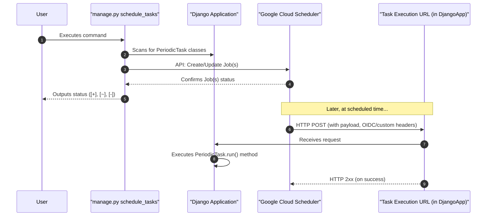

# Scheduled Tasks (Cron Jobs) :fontawesome-solid-calendar-alt:

Scheduled tasks, often known as cron jobs, are tasks that run automatically at predefined times or intervals. `django-cloud-tasks` leverages Google Cloud Scheduler to manage and execute these tasks.

## Defining a Scheduled Task :fontawesome-solid-stopwatch:

To define a scheduled task, you create a class that inherits from `django_cloud_tasks.tasks.PeriodicTask` and implement the `run()` method. Additionally, you **must** define the schedule using the `run_every` attribute.

**Example: Daily Digest and Hourly Cleanup**

```python title="tasks.py"
from django_cloud_tasks.tasks import PeriodicTask
from django.utils import timezone

class GenerateDailyUserActivityDigest(PeriodicTask):
    run_every = "0 0 * * 1-5" # (1)!

    def run(self, **kwargs):
        print(f"Generating daily user activity digest for {timezone.now().date()}...")
        # TODO: Implement the logic to generate the daily user activity digest
        return {"status": "digest_generated", "date": str(timezone.now().date())}


class HourlyTemporaryFileCleanup(PeriodicTask):
    run_every = "@hourly"  # (2)!

    def run(self, older_than_hours: int = 2, **kwargs): # (3)!
        print(f"Cleaning up temporary files older than {older_than_hours} hours...")
        # TODO: Implement the logic to clean up temporary files
        return {"status": "cleanup_done", "older_than_hours": older_than_hours}
```

1.  Cron expression: "At 00:00 (UTC by default) on every day-of-week from Monday through Friday."
2.  Cloud Scheduler shorthand for "0 * * * *" (at the beginning of every hour).
3.  The `run` method can accept parameters. If a payload is configured for the Cloud Scheduler job (see Custom Payload section), those key-values will be passed here. Otherwise, only default parameter values are used.

**Key Attributes for `PeriodicTask`:**

*   **`run_every: str` (Required):** Defines the schedule using the standard [cron format](https://cloud.google.com/scheduler/docs/configuring/cron-job-schedules). Cloud Scheduler also supports shorthands like `@daily`, `@hourly`, `@weekly`, `@monthly`, `@yearly`.
*   **`run(**kwargs)`:** The method containing your task's logic. It's the same as for on-demand tasks. Any JSON payload you define in Cloud Scheduler (or through customization hooks) will be passed as `kwargs`.

## Deploying Scheduled Tasks :fontawesome-solid-cloud-arrow-up:

Defining the `PeriodicTask` class in your Python code doesn't automatically create or update the job in Google Cloud Scheduler. You need to run a management command:

```bash
python manage.py schedule_tasks
```

**What this command does:**

1.  **Scans your project** for all classes that inherit from `PeriodicTask`.
2.  For each task found, it **compares its definition** (schedule, payload, OIDC settings, etc.) with what's currently configured in Google Cloud Scheduler for a job with the same name (derived from the task class).
3.  It then **creates, updates, or deletes** jobs in Google Cloud Scheduler as needed to match your Python definitions.
    *   `[+] Job created: your_app.tasks.NightlyCleanupTask`
    *   `[~] Job updated: your_app.tasks.HourlyReportTask` (if, for example, `run_every` changed)
    *   `[-] Job deleted: your_app.tasks.OldRemovedTask` (if a task class was removed from code)

**When to run `schedule_tasks`?**

Run this command as part of your **deployment process**. Any time you add a new `PeriodicTask`, remove one, or change its `run_every` schedule or other schedule-related attributes, you should run this command to synchronize your GCP environment.

!!! info "Idempotency"
    The `schedule_tasks` command is idempotent. You can run it multiple times, and it will only make changes if there are differences between your code and the state in Google Cloud Scheduler.

## Customizing Scheduled Task Behavior :fontawesome-solid-sliders-h:

`PeriodicTask` offers several attributes and methods to customize how it's scheduled and executed.

### Custom Job Name (`schedule_name`)

By default, the Google Cloud Scheduler job name is derived from the task's class path (e.g., `your_app.tasks.NightlyCleanupTask`, potentially prefixed by `DJANGO_CLOUD_TASKS_APP_NAME`). You can provide a custom name:

```python title="tasks.py"
class CustomNamedJob(PeriodicTask):
    run_every = "0 0 1 * *" # First day of every month

    @classmethod
    def schedule_name(cls) -> str: # (1)!
        return "monthly-financial-summary"

    def run(self):
        # ... generate financial summary ...
        return {"summary": "done"}
```
1.  The job in GCP will be named `monthly-financial-summary` (or `my-app--monthly-financial-summary`).

### Custom Headers for Scheduler (`schedule_headers`)

If the HTTP request made by Cloud Scheduler to your Django app needs specific headers (e.g., for an external gateway or specific tracing), you can define them:

```python title="tasks.py"
class TaskWithCustomHeaders(PeriodicTask):
    run_every = timedelta(minutes=30)

    @classmethod
    def schedule_headers(cls) -> dict[str, str]: # (1)!
        return {
            "X-Custom-Auth-Token": "some_secret_value",
            "X-Source-System": "django-scheduler"
        }

    def run(self):
        # Headers will be available in self.request.META or self._metadata.headers
        # if DJANGO_CLOUD_TASKS_PROPAGATE_HEADERS is True
        return {"status": "ok"}
```
1.  These headers will be sent by Google Cloud Scheduler when it triggers your task.

### OIDC Authentication (`schedule_use_oidc`)

By default (`schedule_use_oidc = True`), `django-cloud-tasks` configures Cloud Scheduler jobs to use OIDC authentication. Google Cloud Scheduler will send an OIDC token in the `Authorization` header, which your Django app (running on Cloud Run, GKE, or App Engine) can validate.

If you are running your Django app in an environment that cannot validate these tokens, or if you have a different authentication mechanism (e.g., an API gateway in front), you might disable this:

```python title="tasks.py"
class NoOidcTask(PeriodicTask):
    run_every = "every 2 hours"
    schedule_use_oidc = False # (1)!

    def run(self):
        # ... task logic ...
        return {"oidc_disabled": True}
```
1.  The Cloud Scheduler job will be created without an OIDC token configuration. Your endpoint needs to be publicly accessible or use a different auth method.

### Custom Retry Configuration for Scheduler (`schedule_retries`)

Google Cloud Scheduler has its own retry mechanism if the HTTP call to your task endpoint fails (e.g., returns a 5xx error or times out). You can customize these retry attempts:

```python title="tasks.py"
class TaskWithCustomRetries(PeriodicTask):
    run_every = "0 * * * *" # Every hour at minute 0

    @classmethod
    def schedule_retries(cls) -> int | None: # (1)!
        return 5  # Attempt up to 5 times if the initial call fails

    # You can also specify min/max backoff and max duration for retries
    # @classmethod
    # def schedule_min_backoff(cls) -> timedelta | None:
    #     return timedelta(seconds=30)
    # @classmethod
    # def schedule_max_backoff(cls) -> timedelta | None:
    #     return timedelta(minutes=10)
    # @classmethod
    # def schedule_max_doublings(cls) -> int | None: # How many times to double backoff
    #     return 3

    def run(self):
        # ... task logic ...
        return {"status": "processed"}
```
1.  Corresponds to `RetryConfig.retry_count` in Cloud Scheduler.

### Custom Payload (`schedule_body_payload`)

While `PeriodicTask` usually doesn't require a payload (as it's run on a schedule, not in response to specific data), you can send a JSON payload from Cloud Scheduler if needed. This payload will be passed as keyword arguments to your `run()` method.

```python title="tasks.py"
class TaskWithPayload(PeriodicTask):
    run_every = "0 9 * * 1-5"  # 9 AM on weekdays

    @classmethod
    def schedule_body_payload(cls) -> dict | None: # (1)!
        return {
            "report_type": "daily_sales",
            "region": "emea"
        }

    def run(self, report_type: str, region: str):
        print(f"Running scheduled task for report: {report_type} in region: {region}")
        # ... logic using report_type and region ...
        return {"processed_report": report_type, "region": region}
```
1.  The `run` method will receive `report_type="daily_sales"` and `region="emea"`.

### Other Schedule Attributes

`PeriodicTask` allows further customization of the Cloud Scheduler job via class methods, corresponding to `Job` attributes in the GCP API:

*   `schedule_description() -> str | None`: A human-readable description for the job.
*   `schedule_time_zone() -> str | None`: Timezone for cron schedules (e.g., "America/New_York"). Default is UTC.
*   `schedule_attempt_deadline() -> timedelta | None`: Time limit for Cloud Scheduler to attempt to deliver the PUSH request to your app. If the task handler takes longer than this, Scheduler might consider it a failure. Default is 3 minutes.

## How It Works Under the Hood :fontawesome-solid-cogs:

When `PeriodicTask.schedule()` is invoked (typically by the `schedule_tasks` management command), it communicates with Google Cloud Scheduler to create or update a job. This job is configured to:

1.  Trigger based on the `run_every` cron schedule.
2.  Make an HTTP POST request to the URL generated by `YourTaskClass.url()` (this defaults to the standard task execution endpoint in `django_cloud_tasks.urls`).
3.  Include a JSON payload (by default, an empty dictionary `{}` unless `kwargs` were passed to `schedule` or the task sends a default payload).
4.  Use OIDC authentication and custom headers as configured.

Essentially, Cloud Scheduler acts as a timed trigger that invokes your `PeriodicTask` as if it were an on-demand task call arriving at your application's endpoint.



**Eager Mode Behavior (`DJANGO_CLOUD_TASKS_EAGER = True`)**
If `DJANGO_CLOUD_TASKS_EAGER` is true, running `python manage.py schedule_tasks` will *not* actually interact with Google Cloud Scheduler. Instead, for any tasks that *would have been* added or updated, their `run()` method will be executed synchronously, locally, one time. This is primarily for testing the task logic itself, not the scheduling mechanism.

And that's the rundown on keeping your tasks running like clockwork with scheduled tasks!